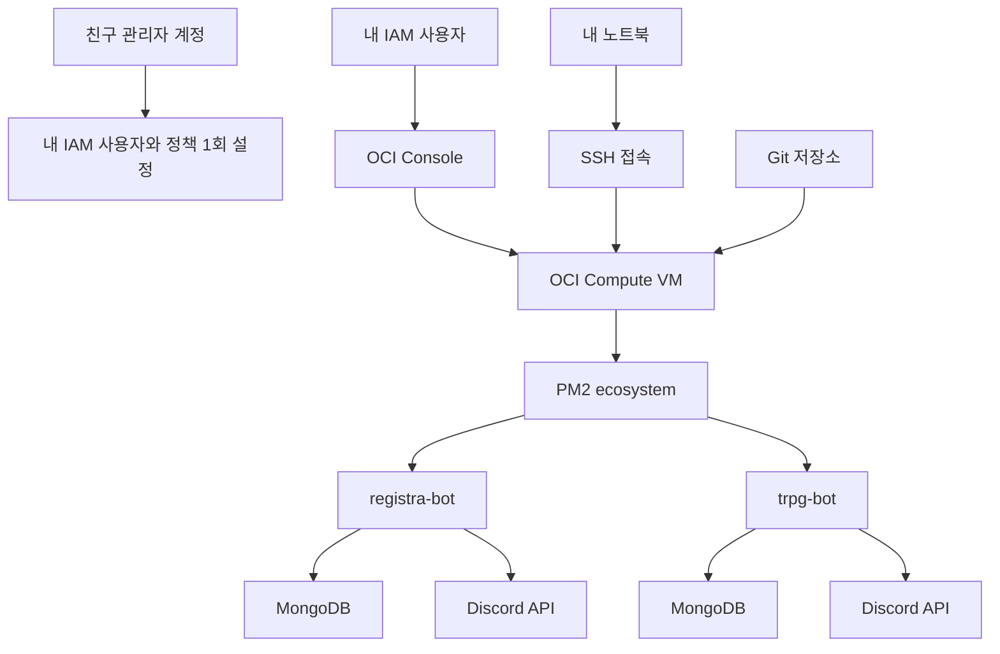

# OCI Compute + PM2 멀티 봇 배포 가이드

이 문서는 `registra-bot` 하나만 올리는 수준이 아니라, OCI VM 한 대에서 `registra-bot`, `trpg-bot` 같은 여러 Node 기반 Discord 봇을 `PM2`로 함께 운영하는 구조를 기준으로 작성했습니다.

핵심 방향은 다음과 같습니다.

- OCI는 `Compute VM` 한 대를 쓴다.
- 친구 계정을 계속 빌리지 않고 `내 전용 IAM 사용자`로 접속한다.
- 봇은 서버 안에서 `PM2 ecosystem`으로 함께 관리한다.
- 비용이 중요하면 `Always Free` shape를 우선 검토한다.
- PNG 렌더링처럼 Puppeteer가 필요한 봇은 메모리와 CPU 여유를 고려한다.

## 지금 뭐부터 해야 하나

가장 먼저 할 일은 `코드 배포`가 아니라 `OCI 접근 권한 분리`입니다.

지금 당신이 바로 시작해야 하는 첫 단계는 이것입니다.

1. 친구에게 잠깐 접속을 부탁한다.
2. 친구 관리자 계정으로 OCI에 로그인한다.
3. 지금은 `빠른 운영 경로`를 선택했으므로 이 문서의 `4. 친구 계정 문제를 먼저 끝내는 법` 섹션대로
   - `novus-ordo-bots` 컴파트먼트 생성
   - 내 전용 사용자 생성
   - 그 사용자를 `Administrators` 그룹에 추가
4. 그다음부터는 친구 계정이 아니라 `내 사용자`로만 진행한다.

즉, 오늘의 출발점은 `VM 만들기`가 아니라 `내 OCI 사용자 만들기`입니다.

## 실행 순서 요약

아래 순서대로만 진행하면 됩니다.

1. 내 전용 IAM 사용자와 정책 만들기
2. 리전, Reserved Public IP, VCN 준비하기
3. OCI Compute VM 생성하기
4. SSH 접속 후 Node.js, PM2 설치하기
5. 저장소 clone 후 `registra-bot`, `trpg-bot` `.env` 만들기
6. 두 봇 `npm ci`, `npm run build` 실행하기
7. `PM2 ecosystem`으로 두 봇 동시에 띄우기
8. `pm2 startup`, `pm2 save`로 재부팅 자동 복구 설정하기
9. Discord와 MongoDB 연결 검증하기
10. 안정화 후 PNG 기능과 추가 봇 확장하기

## 진행 현황판

이 섹션을 기준으로 앞으로 진행 상황을 체크하면 됩니다.

- [x] 1단계: 친구 관리자 계정으로 `novus-ordo-bots` 컴파트먼트 생성
- [x] 2단계: 내 전용 OCI 사용자 생성
- [x] 3단계: 내 사용자를 `Administrators` 그룹에 추가
- [x] 4단계: 내 사용자로 다시 로그인 성공
- [x] 5단계: Reserved Public IP 생성
- [x] 6단계: VCN + public subnet 생성
- [ ] 7단계: OCI Compute VM 생성
- [ ] 8단계: SSH 접속 성공
- [ ] 9단계: Node.js, npm, PM2 설치
- [ ] 10단계: 저장소 clone 완료
- [ ] 11단계: `registra-bot/.env` 작성
- [ ] 12단계: `trpg-bot/.env` 작성
- [ ] 13단계: `registra-bot` 빌드 성공
- [ ] 14단계: `trpg-bot` 빌드 성공
- [ ] 15단계: PM2로 두 봇 기동 성공
- [ ] 16단계: `pm2 startup` + `pm2 save` 완료
- [ ] 17단계: Discord online 및 슬래시 명령 확인
- [ ] 18단계: MongoDB 연결 및 실제 동작 확인
- [ ] 19단계: 필요 시 PNG 기능 활성화

## 진행 로그

앞으로 이 문서에서 진행 관리를 할 때는 아래 형식으로 업데이트하면 됩니다.

```text
- 2026-04-10 18:42 - 루트 컴파트먼트 하위에 `novus-ordo-bots` 구획 생성 완료
- 2026-04-10 18:45 - 운영 편의 우선 방침에 따라 `Administrators` 직행 경로 선택
- 2026-04-10 18:48 - 내 전용 관리자 사용자 생성 후 로그인 검증 단계로 이동
- 2026-04-10 19:05 - 내 전용 계정으로 OCI 로그인 완료, 네트워크 리소스 생성 단계로 이동
- 2026-04-10 19:09 - `novus-ordo-bots-ip` 예약 퍼블릭 IPv4 주소 생성 완료
- 2026-04-10 19:25 - `novus-ordo-bots-vcn` 생성 완료, public subnet 생성 단계로 이동
- 2026-04-10 19:27 - `novus-ordo-bots-public-subnet` 생성 완료, Compute VM 생성 단계로 이동
- 2026-04-10 19:45 - `VM.Standard.A1.Flex` 생성 시 AD-1 용량 부족 오류 발생, 가용성 도메인 변경 우선 시도
- YYYY-MM-DD HH:MM - 완료한 작업
- YYYY-MM-DD HH:MM - 막힌 지점
- YYYY-MM-DD HH:MM - 다음에 할 작업
```

## 지금 당장 해야 할 행동

오늘 바로 해볼 일만 아주 짧게 적으면 아래입니다.

1. `Compute` → `Instances` 로 이동한다.
2. `Create instance` 또는 `인스턴스 생성`을 누른다.
3. 아래 기준으로 입력한다.
   - Name: `novus-ordo-bots-vm`
   - Compartment: `novus-ordo-bots`
   - Image: Ubuntu 24.04 LTS 또는 Oracle Linux 9
   - VCN: `novus-ordo-bots-vcn`
   - Subnet: `novus-ordo-bots-public-subnet`
4. SSH 키 생성/업로드 화면까지 간 뒤 멈추고 나한테 화면 옵션을 보여준다.

현재 실제 blocker 발생 시 우회 순서:

1. 같은 설정 그대로 `가용성 도메인`만 `AD-2` 또는 `AD-3`로 바꿔 다시 시도
2. 그래도 안 되면 시간 간격을 두고 `VM.Standard.A1.Flex` 재시도
3. 급하면 임시로 `VM.Standard.E2.1.Micro` 같은 Always Free 대안으로 먼저 서버만 띄우고, 이후 A1.Flex로 재생성

중요:

- 지금 오류는 권한이나 네트워크 문제가 아니라 `해당 AD의 호스트 용량 부족`
- 가장 먼저 바꿔볼 것은 `Shape`가 아니라 `Availability Domain`
- `결함 도메인`은 수동 지정하지 않는 것이 안전
- 같은 리전 안의 `AD-1`, `AD-2`, `AD-3` 차이로 Discord 봇 체감 속도가 크게 느려지는 경우는 보통 거의 없습니다.
- 실제 체감에 더 큰 영향을 주는 것은 `리전`, `VM 메모리`, `외부 서비스(Discord/MongoDB)` 상태입니다.
- 따라서 `가장 싼 비용 + 가장 안정적 운영` 목표라면, 같은 리전 안에서 `A1.Flex` 용량이 나는 AD를 잡는 것이 가장 합리적입니다.
- 이미 만든 `regional subnet`은 다른 AD 인스턴스에도 그대로 연결할 수 있습니다.

이미 `VM.Standard.E2.1.Micro`로 임시 인스턴스를 만든 뒤 `VM.Standard.A1.Flex`로 옮기고 싶을 때:

- 실무적으로는 `기존 인스턴스를 수정`하기보다 `A1.Flex 새 인스턴스를 다시 생성`하는 쪽이 안전합니다.
- 이유는 `E2.Micro`는 x86 계열이고 `A1.Flex`는 Arm 계열이라 아키텍처가 다르기 때문입니다.
- 운영 순서는 아래처럼 가져가면 됩니다.
  1. 기존 E2.Micro 인스턴스를 임시 운영용으로 둔다.
  2. A1.Flex 용량이 보이는 AD에서 새 Ubuntu 인스턴스를 다시 만든다.
  3. 기존 예약 공인 IP `novus-ordo-bots-ip`를 새 인스턴스로 옮긴다.
  4. 새 서버에 저장소, `.env`, PM2 설정을 다시 올린다.
  5. 새 서버 정상 동작 확인 후 기존 E2.Micro 인스턴스를 정리한다.

## 1. 왜 이 구조로 가는가

`PM2`는 여러 프로세스를 한 서버에서 함께 관리할 때 가장 단순합니다. `Container Instance`는 서버 관리가 적다는 장점이 있지만, 지금처럼 여러 봇을 한꺼번에 운영하고 `PM2`로 묶고 싶다면 오히려 `Compute VM`이 더 자연스럽습니다.

현재 저장소 기준으로 바로 묶을 수 있는 앱은 다음과 같습니다.

- `registra-bot`
- `trpg-bot`

루트의 `deploy/pm2/ecosystem.config.cjs`는 이 두 봇을 바로 PM2에 등록하도록 작성되어 있습니다.

## 2. 추천 토폴로지



## 3. 먼저 결정할 것

### 3-1. 가장 쉬운 운영 경로

- 운영 방식: `OCI Compute VM + PM2`
- 서버 수: 1대
- 운영 대상: 여러 봇 동시 실행
- 재부팅 복구: `PM2 startup`
- 코드 반영: `git pull` + 빌드 + `pm2 reload`

### 3-2. 비용/호환성 판단

우선 아래 기준으로 시작하는 것을 권장합니다.

1. 비용이 최우선이면 `Always Free` shape를 먼저 검토합니다.
2. PNG 렌더링을 꼭 써야 하면 메모리 여유가 있는 shape가 더 안전합니다.
3. ARM에서 Puppeteer가 번거로우면 초기에는 `RESULT_CARD_IMAGE=0`으로 두고 먼저 안정화합니다.

실전 추천은 아래 둘 중 하나입니다.

- 저비용 우선: `VM.Standard.A1.Flex`
- 안정성 우선: x86 계열 소형 유료 Flex VM

주의할 점은 `registra-bot`과 `trpg-bot` 모두 `puppeteer` 의존성이 있다는 것입니다. 메모리가 너무 낮으면 PM2가 아니라 브라우저 렌더링에서 먼저 불안정해질 수 있습니다.

## 4. 친구 계정 문제를 먼저 끝내는 법

이 단계는 친구가 관리자 계정으로 딱 한 번만 해주면 됩니다.

### 4-1. 컴파트먼트 생성

OCI 콘솔 경로:

- `Identity & Security` → `Compartments`

생성 권장값:

- Name: `novus-ordo-bots`
- Description: `Discord bots operated by shared project members`

이 컴파트먼트 안에 VM, 네트워크, 공인 IP 같은 봇 운영 리소스를 모읍니다.

### 4-2. 내 전용 그룹 생성

OCI 콘솔 경로:

- `Identity & Security` → `Domains` → 사용하는 도메인 → `Groups`

권장 이름:

- `novus-ordo-bot-operators`

지금 선택한 경로에서는 이 그룹을 굳이 만들 필요 없습니다. 빠르게 진행하려면 이 단계를 건너뛰고 `Administrators` 그룹에 내 사용자를 넣으면 됩니다.

### 4-3. 내 전용 사용자 생성

OCI 콘솔 경로:

- `Identity & Security` → `Domains` → 사용하는 도메인 → `Users`

권장 방식:

- 이메일 기반 사용자 생성
- 내 개인 이메일 사용
- 빠른 운영 경로에서는 생성 직후 `Administrators` 그룹에 추가

로그인 관련 매우 중요한 메모:

- `도메인 세부정보`에 보이는 `Domain URL`은 로그인 진입 주소가 아닐 수 있습니다.
- 그 주소를 직접 열었을 때 `401 Authorization Required`가 나오면 잘못 들어간 것이 맞습니다.
- 가장 안전한 로그인 방법은 `https://cloud.oracle.com`로 들어간 뒤 친구가 알려준
  - `Cloud Account Name`(테넌시/클라우드 계정 이름, 이메일 아님)
  - 로그인 ID(이메일 또는 username)
  - 도메인 정보
    를 사용해 로그인하는 것입니다.
- 또는 도메인 화면에 `Sign-in URL`, `Copy sign-in URL`이 따로 있으면 그 주소를 사용합니다.
- `Cloud Account Name` 입력 칸에 내 이메일을 넣으면 `That name didn't work`가 뜨는 것이 정상입니다.
- 보통 순서는
  1. `cloud.oracle.com` 접속
  2. `Cloud Account Name`에 친구 테넌시의 계정명 입력
  3. 도메인 선택
  4. 그 다음 화면에서 내 이메일 또는 username과 비밀번호 입력
     입니다.
- 사용자 생성만 했다고 바로 비밀번호가 생기지는 않을 수 있습니다.
- 이 경우 아래 둘 중 하나가 필요합니다.
  1. 사용자 생성 시 발송된 초대/환영 메일에서 비밀번호 최초 설정
  2. 관리자 계정에서 내 사용자에 대해 `Reset password` 실행 후 재설정 메일 수신

### 4-4. 정책 생성

OCI 콘솔 경로:

- `Identity & Security` → `Policies`

빠른 운영 경로에서는 별도 정책 생성이 필수는 아닙니다. `Administrators` 그룹은 이미 테넌시 전체 관리자 권한을 가지기 때문입니다.

즉, 지금은 이 섹션을 건너뛰어도 됩니다.

초기에는 가장 단순하고 덜 헷갈리게, `novus-ordo-bots` 컴파트먼트 한정으로 넓게 주는 편이 낫습니다.

정책 예시:

```text
Allow group novus-ordo-bot-operators to manage all-resources in compartment novus-ordo-bots
```

이 정책은 범위가 `novus-ordo-bots` 컴파트먼트 안으로 제한되므로, 초보 단계에서는 가장 운영하기 쉽습니다.

### 4-5. 내 사용자 보안 강화

친구가 초기 세팅을 끝내면, 이제부터는 내 사용자로 로그인합니다.

권장 추가 작업:

- 내 사용자 MFA 활성화
- 친구 관리자 계정 공유 중단
- 내 사용자용 SSH 공개키 별도 관리

로그인 트러블슈팅:

- `Domain URL` 접속 시 `401 Authorization Required`가 뜨면 정상적인 로그인 화면 주소가 아닐 가능성이 높습니다.
- 이 경우 `https://cloud.oracle.com`로 접속해서 로그인하거나, 도메인 화면의 `Sign-in URL`을 다시 받아야 합니다.
- `Cloud Account Name` 칸에 내 이메일을 넣으면 안 됩니다. 이 칸은 사용자 계정이 아니라 테넌시 이름을 받는 칸입니다.
- 로그인 화면까지 왔는데 비밀번호를 만든 적이 없다면, 관리자에게 `Reset password`를 눌러달라고 요청하면 됩니다.
- 로그인 성공 기준은 `novus-ordo-bots` 컴파트먼트가 보이고 `Compute`, `Networking` 메뉴에 접근되는 것입니다.

### 4-6. 지금 선택한 빠른 경로 정리

현재는 `운영 편의 우선` 경로를 선택했으므로 실제 해야 할 일은 아래 2개입니다.

1. 내 전용 사용자 생성
2. 그 사용자를 `Administrators` 그룹에 추가

이 2개가 끝나면 별도 운영 그룹이나 별도 정책 생성 없이 바로 다음 단계로 넘어갑니다.

## 5. OCI에서 VM을 GUI로 만드는 순서

### 5-1. 리전 고정

화면 오른쪽 위 리전 선택에서 한 리전을 고정합니다.

권장 기준:

- 한국/일본 등 가까운 리전 우선
- Always Free shape 가용 여부 확인
- 나중에 계속 쓸 리전으로 시작

### 5-2. Reserved Public IP 먼저 만들기

이건 매우 중요합니다. 인스턴스를 교체해도 SSH 접속 주소를 유지하기 쉬워집니다.

OCI 콘솔 경로:

- `Networking` → `IP management` → `Reserved public IPs`

생성 권장값:

- Name: `novus-ordo-bots-ip`
- Compartment: `novus-ordo-bots`

### 5-3. VCN 생성

OCI 콘솔 경로:

- `Networking` → `Virtual cloud networks`

초기 권장:

- `Start VCN Wizard`
- `VCN with Internet Connectivity`

권장 이름:

- VCN: `novus-ordo-bots-vcn`
- Public Subnet: `novus-ordo-bots-public-subnet`

### 5-4. SSH 보안 규칙 최소화

보안 리스트 또는 NSG에서 아래만 먼저 허용합니다.

- 인바운드 TCP 22
- Source: 내 집/회사 공인 IP `/32`

중요:

- `0.0.0.0/0`로 SSH를 열지 않는 것이 좋습니다.
- Discord 봇은 외부 인바운드 포트가 보통 필요 없습니다.
- 80/443은 웹앱을 같은 VM에 올릴 때만 추가 검토합니다.

### 5-5. Compute 인스턴스 생성

OCI 콘솔 경로:

- `Compute` → `Instances` → `Create instance`

권장 입력 순서:

1. Name: `novus-ordo-bots-vm`
2. Compartment: `novus-ordo-bots`
3. Image: Ubuntu 24.04 LTS 또는 Oracle Linux 9
4. Shape:
   - 비용 우선: `VM.Standard.A1.Flex`
   - 안정성 우선: x86 소형 Flex
5. Networking:
   - 위에서 만든 VCN 선택
   - public subnet 선택
6. Public IP:
   - 가능하면 Reserved Public IP 연결
7. SSH key:
   - 가장 쉬운 경로는 `자동으로 키 쌍 생성`
8. Boot volume:
   - 기본값으로 시작하되 여유가 있으면 약간 증설

권장 메모:

- 봇 2개를 같이 올릴 거면 `1GB`는 빠듯할 수 있습니다.
- Puppeteer PNG 기능을 켜둘 생각이면 메모리 여유를 더 두는 편이 좋습니다.

실제 현재 선택값 기준 권장:

- Image: `Canonical Ubuntu 24.04`
- Shape: `VM.Standard.A1.Flex`
- 시작 스펙: `1 OCPU / 6GB RAM`
- 실드된 인스턴스: 끔
- VCN: `novus-ordo-bots-vcn`
- Subnet: `novus-ordo-bots-public-subnet`
- Private IPv4: 자동 할당
- Public IPv4: 반드시 켜고, 가능하면 기존 예약 IP `novus-ordo-bots-ip` 연결
- IPv6: 끔
- SSH 키: `자동으로 키 생성`을 선택하고, 생성 직후 private key 파일을 반드시 내려받아 보관

네트워킹/SSH 화면에서 중요한 함정:

- `자동으로 퍼블릭 IPv4 주소 지정` 토글이 꺼져 있으면 외부 SSH 접속이 되지 않습니다.
- 가능하면 새 임시 공인 IP를 만들지 말고, 기존에 예약한 `novus-ordo-bots-ip`를 연결하는 편이 좋습니다.
- `SSH 키 추가`에서 `자동으로 키 생성`을 선택했다면 private key를 지금 이 순간 저장하지 않으면 나중에 다시 받을 수 없습니다.

검토(Review) 화면에서 반드시 다시 볼 것:

- Image가 `Canonical Ubuntu 24.04`인지
- Shape가 `VM.Standard.A1.Flex`인지
- 메모리가 `6GB`인지
- 검토 화면에서 `Oracle Linux 9` 또는 `VM.Standard.E2.1.Micro`로 보이면 생성하지 말고 이전 단계로 돌아가 다시 선택

비용 표시 관련 메모:

- OCI 예상 비용 화면은 `Always Free` 혜택이 즉시 완전히 반영되지 않거나, 부트 볼륨 비용이 별도로 보일 수 있습니다.
- 하지만 `검토 화면 값`이 잘못되어 있으면 비용 표시도 의미가 없으므로, 먼저 Image/Shape가 원하는 값으로 유지됐는지부터 확인합니다.

## 6. VM 생성 직후 해야 할 일

인스턴스가 `RUNNING`이 되면 공인 IP로 SSH 접속합니다.

```bash
ssh ubuntu@<YOUR_RESERVED_PUBLIC_IP>
```

Oracle Linux 계열이면 기본 사용자가 `opc`일 수 있습니다.

## 7. 서버 안에서 기본 패키지 설치

아래는 Ubuntu 기준 예시입니다.

```bash
sudo apt update
sudo apt install -y git curl build-essential ca-certificates
curl -fsSL https://deb.nodesource.com/setup_20.x | sudo -E bash -
sudo apt install -y nodejs
sudo npm install -g pm2
```

버전 확인:

```bash
node -v
npm -v
pm2 -v
```

## 8. Puppeteer 대비 운영 원칙

`registra-bot`과 `trpg-bot`은 모두 `puppeteer`를 사용합니다.

초기 운영 권장 순서:

1. 먼저 `.env`에서 `RESULT_CARD_IMAGE=0`으로 두고 봇을 안정적으로 띄운다.
2. PM2 재시작과 Discord 동작이 안정적인지 확인한다.
3. 이후 여유가 생기면 PNG 기능을 켠다.

Ubuntu에서 PNG 기능까지 같이 쓰고 싶다면 보통 다음 계열 패키지가 필요합니다.

```bash
sudo apt install -y \
  fonts-liberation \
  libasound2 \
  libatk-bridge2.0-0 \
  libatk1.0-0 \
  libcups2 \
  libdrm2 \
  libgbm1 \
  libgtk-3-0 \
  libnspr4 \
  libnss3 \
  libxcomposite1 \
  libxdamage1 \
  libxfixes3 \
  libxkbcommon0 \
  libxrandr2 \
  xdg-utils
```

배포 초반에는 PNG를 끈 상태로 성공 경험을 먼저 만드는 편이 훨씬 쉽습니다.

## 9. 저장소 배치 구조

서버 안에서 아래 구조를 권장합니다.

```text
~/apps/StarGate/
  deploy/pm2/ecosystem.config.cjs
  registra-bot/
  trpg-bot/
  StarGateV2/
```

복제:

```bash
mkdir -p ~/apps
cd ~/apps
git clone <YOUR_GIT_REMOTE_URL> StarGate
cd ~/apps/StarGate
```

## 10. 봇별 `.env` 만들기

### 10-1. registra-bot

```bash
cd ~/apps/StarGate/registra-bot
cp .env.example .env
nano .env
```

최소 필수:

- `DISCORD_TOKEN`
- `DISCORD_CLIENT_ID`
- `MONGODB_URI`

초기 권장:

- `RESULT_CARD_IMAGE=0`

### 10-2. trpg-bot

```bash
cd ~/apps/StarGate/trpg-bot
cp .env.example .env
nano .env
```

최소 필수:

- `DISCORD_TOKEN`
- `DISCORD_CLIENT_ID`
- `MONGODB_URI`

초기 권장:

- `RESULT_CARD_IMAGE=0`

## 11. 각 봇 빌드

PM2는 이 저장소에서 `dist/index.js`를 직접 실행합니다. 따라서 빌드가 먼저 필요합니다.

```bash
cd ~/apps/StarGate/registra-bot
npm ci
npm run build

cd ~/apps/StarGate/trpg-bot
npm ci
npm run build
```

## 12. PM2로 여러 봇 한 번에 띄우기

루트에 이미 공용 설정이 있습니다.

- `deploy/pm2/ecosystem.config.cjs`

실행:

```bash
cd ~/apps/StarGate
pm2 start deploy/pm2/ecosystem.config.cjs
pm2 list
```

정상이라면 `registra-bot`, `trpg-bot` 두 프로세스가 `online`으로 떠야 합니다.

## 13. 재부팅 후에도 자동 시작되게 만들기

```bash
pm2 save
pm2 startup
```

`pm2 startup`이 마지막에 출력하는 명령을 그대로 한 번 더 실행합니다. 이 단계까지 해야 OCI VM이 재부팅되어도 봇이 자동으로 다시 올라옵니다.

마지막으로 다시 저장:

```bash
pm2 save
```

## 14. 첫 검증 체크리스트

### 14-1. 서버 레벨

- `pm2 list`에서 두 봇이 모두 `online`
- `pm2 logs registra-bot --lines 100`에 치명적 예외 없음
- `pm2 logs trpg-bot --lines 100`에 치명적 예외 없음

### 14-2. Discord 레벨

- 봇이 온라인 상태인지 확인
- 슬래시 명령이 자동 등록되는지 확인
- 테스트용 일정 생성/조회 명령 1회 실행

### 14-3. MongoDB 레벨

- 연결 문자열 오타가 없는지 확인
- 신규 문서가 생성되는지 확인

### 14-4. PNG 기능을 켜는 경우

- `RESULT_CARD_IMAGE=1`로 변경
- `pm2 reload deploy/pm2/ecosystem.config.cjs --update-env`
- 실제로 PNG가 첨부되는지 테스트
- 메모리 급증이나 크래시가 없는지 로그 확인

## 15. 평소 배포 루틴

코드가 바뀌면 아래 순서만 반복하면 됩니다.

```bash
cd ~/apps/StarGate
git pull

cd registra-bot
npm ci
npm run build

cd ../trpg-bot
npm ci
npm run build

cd ..
pm2 reload deploy/pm2/ecosystem.config.cjs --update-env
pm2 save
```

이 루틴이 멀티 봇 운영의 핵심입니다. 한 서버에서 여러 봇을 돌려도 배포 흐름이 거의 변하지 않습니다.

## 16. 새 봇을 나중에 추가하는 방법

예를 들어 `new-bot` 디렉터리를 추가했다면:

1. 저장소에 `new-bot`을 추가
2. 서버에서 `npm ci`, `npm run build` 확인
3. `deploy/pm2/ecosystem.config.cjs`에 앱 블록 추가
4. `.env` 작성
5. `pm2 reload deploy/pm2/ecosystem.config.cjs --update-env`

즉, PM2 ecosystem이 앞으로의 멀티 봇 운영 중심점이 됩니다.

## 17. 자주 쓰는 운영 명령

```bash
pm2 list
pm2 logs registra-bot --lines 100
pm2 logs trpg-bot --lines 100
pm2 restart registra-bot
pm2 restart trpg-bot
pm2 reload deploy/pm2/ecosystem.config.cjs --update-env
pm2 save
```

## 18. 장애가 났을 때 보는 순서

1. OCI 콘솔에서 인스턴스가 `RUNNING`인지 확인
2. SSH 접속이 되는지 확인
3. `pm2 list`에서 프로세스 상태 확인
4. `pm2 logs <bot-name>`으로 최근 예외 확인
5. `.env` 값 누락 여부 확인
6. `npm run build`가 실패했는지 확인
7. Puppeteer 문제면 우선 `RESULT_CARD_IMAGE=0`으로 내려서 서비스부터 복구

## 19. StarGateV2는 어떻게 할까

`StarGateV2`는 Next.js 웹앱이라 봇과 성격이 다릅니다.

선택지는 둘입니다.

- 권장: 현재처럼 별도 플랫폼 배포 유지
- 대안: 나중에 이 VM에서도 PM2로 함께 올릴 수 있음

하지만 지금 목표가 `멀티 봇 운영`이라면, 우선은 `registra-bot`과 `trpg-bot`만 PM2로 안정화하는 편이 좋습니다.

## 20. 최종 운영 원칙

- 친구 관리자 계정은 초기 IAM 세팅에만 사용
- 이후 운영은 내 IAM 사용자로만 수행
- 서버는 1대, 프로세스 관리는 PM2로 통일
- 봇별 `.env`는 서버 안에서만 관리
- 첫 배포는 PNG 기능을 꺼서 단순화
- 안정화 후 PNG 기능과 추가 봇을 순차적으로 확장

## 21. 지금 이 저장소에서 바로 쓰는 파일

- `deploy/pm2/ecosystem.config.cjs`
- `deploy/pm2/README.md`
- `docs/OCI_COMPUTE_PM2_MULTI_BOT_DEPLOYMENT.md`

`registra-bot`과 `trpg-bot`은 이 구조를 기준으로 같은 VM에서 함께 운영할 수 있습니다.
