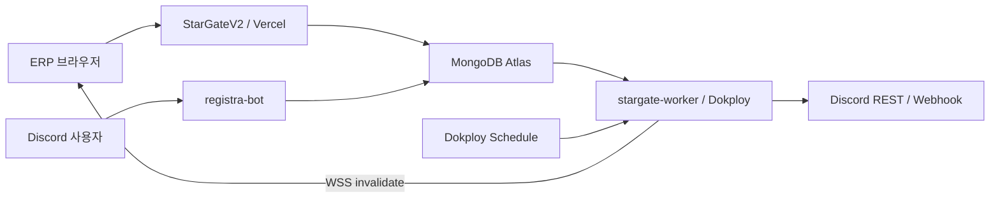

# StarGate 장기 실행 런타임 통합

## 목표

`StarGateV2`의 요청/응답 경계를 유지하면서 Vercel에 맞지 않는 예약 실행, durable 외부 전달, MongoDB Change Stream, ERP WebSocket을 `stargate-worker`로 단계적으로 옮긴다.



## 런타임 책임

| 런타임 | 책임 | 이관하지 않는 것 |
|---|---|---|
| `StarGateV2` | UI, Auth.js, RBAC, 사용자 요청 mutation, 경제 transaction, outbox enqueue | 장기 polling, 비대화형 Discord 전송 |
| `stargate-worker` | 예약 작업, outbox/desired-state drain, Change Stream, `/erp` WebSocket | 세션 쿠키 판정, 사용자 요청 mutation, Discord Gateway |
| `registra-bot` | Gateway, slash/button/autocomplete, 길드 캐시, 자동 마감, Puppeteer 결과 카드 | ERP 알림 생성, 범용 비대화형 webhook |
| `@stargate/shared-db` | Mongo 타입/공용 CRUD, transaction, durable claim/lease, index 정의 | HTTP, Socket.IO, Discord 전송 |
| `@stargate/core` | 런타임 중립 도메인 규칙과 서버 operation | React, Next.js, Discord Gateway |

`trpg-bot`과 `trpg-web`은 이관 대상이 아니지만 `@stargate/shared-db` 변경 시 호환 빌드·배포 판단에 포함한다.

## 현재 구현 상태

| 항목 | 상태 | 안전 경계 |
|---|---|---|
| `@stargate/core` | 구현 | 주식·편의점·연구 규칙과 네 예약 operation, 실시간 계약 |
| Node 22 ESM worker/Docker | 구현 | Chromium 없음, 비루트 `node` 사용자 |
| `/healthz`, `/readyz` | 구현 | ready는 Mongo·consumer·Change Stream이 모두 준비된 경우만 200 |
| graceful shutdown | 구현 | SIGTERM/SIGINT에서 Change Stream → consumer → Mongo → HTTP 순서로 종료 |
| Socket.IO `/erp` | 구현 | WebSocket-only, origin allowlist, HS256 ticket, payload·전체/사용자 연결 수 제한 |
| Change Stream mapper | 구현 | whitelist 컬렉션을 Query resource로만 변환하며 DB 값/PII를 보내지 않음 |
| Change Stream checkpoint | 구현 | `worker_checkpoints` persistent adapter가 기본, 손상 token은 폐기 후 전체 invalidate |
| shadow consumer | 구현 | due 수만 읽고 claim·외부 전송·경제 mutation은 하지 않음 |
| active 예약 job | 구현 | 네 CLI, slot lease heartbeat/token fencing, 최종 시도 crash DEAD 회수 |
| active 범용 outbox | 구현 | 전체 kind fail-fast 등록, 지수 backoff, 최대 8회 및 만료 lease DEAD 회수 |
| active desired-state/아메리 | 구현 | 기존 embedded/desired-state lease와 5분 retry를 유지한 opt-in consumer |
| 운영 heartbeat/연동 경보 | 구현 | secret 없는 활성 kind 요약을 Mongo singleton에 기록하고 지연·DEAD·lease·봇 위임 오류를 운영 webhook으로 경보 |
| ERP realtime client | 구현 | `off/observe/primary`, 연결 상태별 polling fallback, 100ms Query batch, 알림 toast |
| Registra finalization | 구현 | 불변 trigger/operation key, lease/token/nonce, `DELIVERY_UNKNOWN`·legacy 격리로 자동 중복 발송 차단 |
| legacy `tia_bot` | 제거 | 코드·이미지만 삭제, 과거 문서 archive, Mongo 데이터 유지 |
| Dokploy webhook workflow | 구현 | `main`의 worker 영향 경로는 자동 배포, 초기 shadow 배포는 수동 확인 뒤 호출 |

코드 기본값은 `WORKER_MODE=shadow`다. shadow도 Change Stream 재시작을 위해 `worker_checkpoints`와 secret 없는 `worker_runtime_status` heartbeat만 기록하며 경제 상태, queue 상태, 외부 전달은 변경하지 않는다. 실제 배포 모드는 Dokploy 환경 설정을 따른다. active 상시 consumer는 `WORKER_CONSUMERS`로 선택하고, 범용 outbox는 누락 drift를 막기 위해 `WORKER_OUTBOX_KINDS=all`을 요구한다.

초기 shadow 검증을 마친 뒤에는 `main`에 `stargate-worker/**`, `packages/core/**`, `packages/shared-db/**` 또는 관련 workspace·workflow 파일이 변경되면 GitHub Actions가 Dokploy worker webhook을 자동 호출한다. 배포 모드는 저장소가 아니라 Dokploy의 `WORKER_MODE` 설정을 그대로 따른다.

## 패키지 구조

```text
packages/core/
  src/domain/         주식·편의점·연구·시간·realtime 계약
  src/operations/     예약 경제/재고/ERP 알림 operation

stargate-worker/
  src/cli/             Dokploy Application Job 진입점
  src/consumers/       아메리/연구/입고/공시 polling과 shadow probe
  src/jobs/            예약 job dispatcher와 durable run coordinator
  src/outbox/          범용 integration_outbox consumer와 Discord adapter
  src/realtime/        ticket, Change Stream, resource mapper, Socket.IO
  src/health/          health/readiness HTTP
  src/adapters/        shared-db 연결 adapter
```

## 예약 명령

Dokploy Application Job은 동일 이미지에서 다음 명령을 실행한다.

| 작업 | KST | 명령 |
|---|---:|---|
| 편의점 재고 | 매일 11:00 | `node dist/cli/run-job.js shop.refresh` |
| 주식 변동 | 매일 12:00 | `node dist/cli/run-job.js stocks.tick` |
| 일일 수당 | 매일 12:00 | `node dist/cli/run-job.js credits.daily-allowance` |
| ERP 세션 알림 | 매일 21:00 | `node dist/cli/run-job.js sessions.erp-reminders` |

외부 job 실행 HTTP API는 만들지 않는다. 동일 `(jobName, slotKey)` 실행권은 `scheduled_job_runs` unique/lease가 보장하고 장기 handler는 heartbeat로 lease를 갱신한다. 최종 attempt에서 프로세스가 종료돼도 active sweeper가 만료 lease를 `DEAD`로 전환한다. `slotKey`는 KST `YYYY-MM-DD`다. 네 job은 각각 편의점 품목별 날짜 조건, 주식 ticker별 operation key와 transaction, 수당 캐릭터별 일자 ledger, ERP 알림 `dedupeKey`를 추가 불변 조건으로 사용한다.

## 실시간 계약

StarGateV2가 활성 Auth.js 세션을 검증한 뒤 최대 60초 HS256 ticket을 발급한다. worker는 issuer, audience, `version=1`, `status=ACTIVE`, `sub`, `role`, `iat`, `exp`를 handshake에서 검증한다. 60초는 연결 수명이 아니라 handshake 유효기간이다. 정상 role/status 변경은 해당 사용자를 끊고, Change Stream gap은 connection generation을 올려 active socket과 검증 중인 pending handshake를 모두 폐기한다.

서버 이벤트는 두 종류다.

```ts
type RealtimeInvalidateV1 = {
  version: 1;
  id: string;
  type: "invalidate";
  resources: RealtimeResource[];
  emittedAt: string;
};

type RealtimeSessionRefreshV1 = {
  version: 1;
  id: string;
  type: "session-refresh";
  reason: "identity-changed";
  emittedAt: string;
};
```

payload에는 사용자 ID, 이름, 크레딧, 수량, 문서 본문을 넣지 않는다. 브라우저는 resource에 대응하는 TanStack Query를 invalidate/refetch한다. 알림과 플레이어 거래는 Change Stream `fullDocument`에서 worker 내부 라우팅용 사용자 ID만 추출해 대상 socket에만 같은 공개 event를 보내며, 삭제나 라우팅 불명 변경은 전체 invalidate로 안전하게 폴백한다.

`users.role` 또는 `users.status` 변경은 해당 사용자에게 `session-refresh`를 보낸 뒤 socket과 검증 중 handshake를 폐기한다. 브라우저는 현재 세션과 route를 다시 검증하며 비활성 계정은 로그인 경계로 이동한다.

StarGateV2의 `REALTIME_CLIENT_MODE`는 다음 세 단계다.

| 값 | 동작 |
|---|---|
| `off` | WebSocket을 열지 않고 polling fallback을 유지 |
| `observe` | WebSocket invalidation과 polling을 함께 사용해 결과 비교 |
| `primary` | 연결 중 전환 대상 polling을 중지하고 장애 중에만 재개 |

연결 상태는 `connecting`, `connected`, `degraded`, `disabled`로 제공한다. disconnect와 reconnect 때 active Query 전체를 각각 한 번 재검증하고, 평상시 event는 100ms 동안 resource와 Query root를 합쳐 같은 root를 한 번만 refetch한다. event ID는 최근 256개까지만 보관해 중복 전달을 무시한다.

## 환경변수

실제 값은 저장소에 기록하지 않는다. 전체 목록은 [`stargate-worker/.env.example`](../../stargate-worker/.env.example)을 따른다.

- worker: `WORKER_MODE`, `WORKER_REPLICA_COUNT=1`, `WORKER_HOST`, `WORKER_PORT`, `WORKER_POLL_INTERVAL_MS`, `WORKER_CONSUMERS`, `WORKER_OUTBOX_KINDS=all`
- MongoDB: `MONGODB_URI`, `MONGODB_DB_NAME`, `MONGODB_MAX_POOL_SIZE`
- realtime: `REALTIME_TICKET_SECRET`, `REALTIME_TICKET_ISSUER`, `REALTIME_TICKET_AUDIENCE`, `REALTIME_ALLOWED_ORIGINS`, `REALTIME_MAX_PAYLOAD_BYTES`, `REALTIME_MAX_CONNECTIONS`, `REALTIME_MAX_CONNECTIONS_PER_USER`
- web realtime client: `REALTIME_CLIENT_MODE=off|observe|primary`
- delivery: `DISCORD_WEBHOOK_AUDIT_URL`, `DISCORD_WEBHOOK_WORKFLOW_URL`, `DISCORD_WEBHOOK_OPS_URL`, `DISCORD_WEBHOOK_SHOP_URL`, `DISCORD_WEBHOOK_STOCK_URL`, `REGISTRAR_DISCORD_BOT_TOKEN`, `NEXT_PUBLIC_SITE_URL`

`REALTIME_TICKET_SECRET`은 StarGateV2의 ticket 발급 환경과 동일한 최소 32바이트 secret이어야 한다. 값을 로그, CI 출력, 문서에 남기지 않는다.

`WORKER_CONSUMERS`는 `ameri-dm`, `research-card`, `shop-restock`, `stock-market-wire`의 쉼표 구분 opt-in 목록이다. 필요한 Discord secret이 없으면 claim 전에 기동을 거부한다.

`WORKER_OUTBOX_KINDS`는 active에서 `all`을 사용한다. 지원 값은 `GM_ADMIN_AUDIT`, `CHARACTER_EDIT_WEBHOOK`, `EQUIPMENT_WORKSHOP_WEBHOOK`, `SHOP_REORDER_REQUEST_WEBHOOK`, `SHOP_REORDER_FULFILLED_WEBHOOK`, `SHOP_PRODUCT_LAUNCH_WEBHOOK`, `MRBEAST_LOTTERY_WINNER_WEBHOOK`, `STOCK_MANUAL_INTERVENTION_WEBHOOK`, `WORKFLOW_STATUS_WEBHOOK`, `PLAYER_TRADE_DM`이다. 제한된 staging 검증만 `WORKER_OUTBOX_ALLOW_PARTIAL=true`와 명시 목록을 함께 사용할 수 있다. 활성 kind에 필요한 webhook/bot token이 없으면 worker는 outbox를 claim하기 전에 기동을 거부한다.

채널 라우팅은 worker의 typed registry 한 곳에서 관리한다. 감사는 `AUDIT`, 공방 접수·발주 요청·단계 원장은 `WORKFLOW`, 편의점 입고·신제품·복권은 `SHOP`, 주가 개입은 `STOCK`, worker 자체 장애는 `OPERATIONS` destination으로 보낸다. `WORKFLOW`는 전용 URL이 없을 때 `AUDIT`으로, `OPERATIONS`는 전용 URL이 없을 때 `WORKFLOW` 또는 `AUDIT`으로만 폴백한다. 공개 접수 webhook과 예전 캐릭터별 alias는 라우팅 후보가 아니다.

`integration_outbox.dedupeKey`는 queue 문서 중복을 막는다. Bot Create Message 기반 DM은 `nonce`와 `enforce_nonce`도 사용한다. 반면 Discord Execute Webhook에는 같은 nonce 계약이 없으므로, 2xx 응답 직후 프로세스가 종료되는 매우 짧은 구간까지 외부 webhook 정확히 한 번을 보장하지는 못한다. 이 전달은 queue 수준 멱등 + 외부 at-least-once로 분류한다. 엄격한 외부 exactly-once가 필요하면 bot channel 전송 또는 수신측 idempotency/reconciliation을 별도 설계한다.

## 로컬 검증

```bash
pnpm install --frozen-lockfile
pnpm build:worker
pnpm test:worker
cd StarGateV2
pnpm db:preflight-worker-indexes
```

마지막 명령은 대상 MongoDB를 읽기만 하며 필수 인덱스의 이름·key 순서·unique·partial·TTL 옵션, 중복 그룹 수, due query 실행계획을 출력한다. 문서 키나 payload는 출력하지 않고 blocker가 있으면 종료 코드 2를 반환한다. 정확한 순서는 `read-only 검사 → 별도 승인 → one-shot 적용 → exact spec 재검사 → writer 배포`다. Docker 빌드 컨텍스트는 저장소 루트, Dockerfile은 `stargate-worker/Dockerfile`이다.

## 운영 권한 경계

이 구현은 코드와 dry-run/shadow 실행 준비까지만 포함한다. 아래 작업은 대상과 변경 전후 상태를 제시하고 별도 운영 승인을 받은 뒤 수행한다.

- live index/collection 생성
- Dokploy application, schedule, domain, secret 변경
- GitHub Dokploy webhook 실제 호출
- `WORKER_MODE=active` 전환
- Discord DM/webhook 발송
- Dokploy schedule owner 변경 또는 웹 수동 복구 route 호출
- 운영 DB의 크레딧, 인벤토리, 재고, 주식, 알림 변경

세부 순서는 [컷오버 runbook](./cutover-runbook.md), 기능별 소유권은 [이관 매트릭스](./migration-matrix.md)를 따른다.
